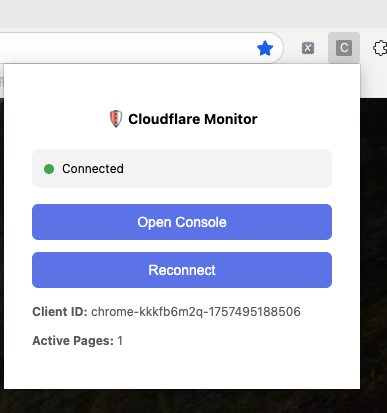
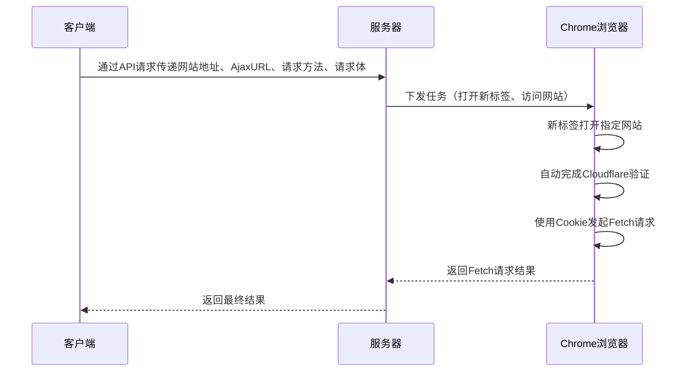

<a id="readme-top"></a>

<!-- PROJECT SHIELDS -->
[![Contributors][contributors-shield]][contributors-url]
[![Forks][forks-shield]][forks-url]
[![Stargazers][stars-shield]][stars-url]
[![Issues][issues-shield]][issues-url]
[![License][license-shield]][license-url]

<!-- PROJECT LOGO -->
<br />
<div align="center">
  <a href="#">
    
  </a>

  <h3 align="center">Cloudflare-faker</h3>

  <p align="center">
    自动绕过 Cloudflare 人机验证的服务工具
    <br />
    让你轻松应对 Cloudflare 验证难题！
  </p>
</div>

<!-- TABLE OF CONTENTS -->
<details>
  <summary>目录</summary>
  <ol>
    <li><a href="#关于项目">关于项目</a></li>
    <li><a href="#准备工作">准备工作</a></li>
    <li><a href="#快速启动">快速启动</a></li>
    <li><a href="#使用建议">使用建议</a></li>
    <li><a href="#注意事项">注意事项</a></li>
    <li><a href="#贡献指南">贡献指南</a></li>
    <li><a href="#许可证">许可证</a></li>
    <li><a href="#联系方式">联系方式</a></li>
    <li><a href="#致谢">致谢</a></li>
  </ol>
</details>

<!-- ABOUT THE PROJECT -->
## 关于项目

这是一个无视 Cloudflare 人机验证(主动质询挑战)进行HTTP访问的服务工具。需要在具有GUI的机器（如MacOS、Windows、GUI Linux）上部署，确保已安装Chrome浏览器和JDK 24环境。启动后，需在Chrome开启开发者模式并导入插件目录`cloudflare_monitor_chrome_plugin`。
[![控制台截图][product-screenshot]](doc/images/console.png)

当你正常安装Chrome插件后，插件会自动连接到本地运行的服务，帮助你自动完成本地服务下发的任务.当浏览器中插件状态变为绿色, 显示`Connected`时, 表示插件已成功连接到本地服务, 可以开始处理Cloudflare验证任务.


**主要功能：**
- 自动管理Cloudflare验证流程
- 提供简单易用的界面和操作流程
- 提供API接口, 允许远程管理Cloudflare网站.
- 通过API远程执行带有Cloudflare质询网站的Fetch请求(包括正常请求/流式请求).
- 通过API远程执行带有Cloudflare质询网站的JavaScript.

**工作原理：**
本项目分为两部分, 分别是服务端(Java任务下发服务), 和Agent端(Chrome插件,用于执行任务).


> **注意：** 该项目仅供学习和研究使用，请勿用于任何非法用途。使用本项目需遵守相关法律法规和网站的服务条款。
> 
> 本项目`执行JavaScript`功能尚不完善, 出于安全策略考量,大部分浏览器不支持. 后续有时间换一种实现思路.

## 准备工作

在运行此项目之前，请确保：
- 拥有一台具有GUI的电脑（MacOS、Windows、GUI Linux等）, 这里叫他Agent机器.
- Agent机器已安装Chrome浏览器
- Agent机器已安装JDK 24环境
- Agent机器在Chrome浏览器中开启开发者模式
- Agent机器导入`cloudflare_monitor_chrome_plugin`插件目录

## 快速启动

1. 在Agent机器的终端（命令行）中执行：
```bash
java -jar Cloudflare-Faker-0.0.1-SNAPSHOT.jar
```
2. 等待输出如下信息，表示启动成功：
```
+--------------------------------------------------------------+
        CloudflareFakerApplication started successfully.
+--------------------------------------------------------------+
 🚀 If the browser did not open automatically,
    please open it manually.

 🔧 Make sure to enable Developer Mode
    and load the extension from the
    'cloudflare_monitor_chrome_plugin' directory
    in the project root.

 🌐 Access the application at:
    http://localhost:8080
```
> 若启动完成后, 没有自动打开浏览器, 请手动打开浏览器,并确保浏览器窗口在最前端显示.

3. 启动成功后，为了插件正常运行：
   - 建议在另一台电脑访问控制台（端口8080）, 尽量保证Agent机器无人干涉, 以免影响验证流程
   - 不要关闭Agent机器的Chrome，否则可能影响验证流程

## 使用建议

- 在另一台电脑上访问控制台（端口8080）以实现更好的验证效果
- 使用Chrome的开发者模式加载插件目录
- 持续保持Agent机器的Chrome窗口开启且在最前端

## 注意事项

- 仅在符合条件的GUI机器上运行
- 确认已正确导入插件目录
- 不要关闭Agent机器Chrome浏览器，以确保验证流程顺利
- 服务端(Java服务)和Agent端(Chrome插件)可以分别部署在不同的机器上, 但需要确保两端网络互通. 
- 若部署在不同机器上, 需要修改`chrome插件`的ws地址, 将`ws://localhost:8080`改为`ws://服务端IP:8080`, 以确保插件能连接到服务端.
- 可以同时部署多个Agent机器, 以提高处理能力. 但需要确保每个Agent机器的Chrome插件都正确连接到服务端.
## 贡献指南

欢迎提交Pull Request或Issue，帮助完善此项目！  
如果你觉得这个工具对你有帮助，请给我点个Star ⭐！

## 许可证

本项目采用MIT许可证，详细信息请查看 LICENSE 文件。

## 联系方式

邮箱：719348277@qq.com  
GitHub： [https://github.com/onlyGuo](https://github.com/onlyGuo)


<!-- MARKDOWN LINKS & IMAGES -->
<!-- https://www.markdownguide.org/basic-syntax/#reference-style-links -->
[contributors-shield]: https://img.shields.io/github/contributors/onlyGuo/Cloudflare-Faker.svg?style=for-the-badge
[contributors-url]: https://github.com/onlyGuo/Cloudflare-Faker/graphs/contributors
[forks-shield]: https://img.shields.io/github/forks/onlyGuo/Cloudflare-Faker.svg?style=for-the-badge
[forks-url]: https://github.com/onlyGuo/Cloudflare-Faker/network/members
[stars-shield]: https://img.shields.io/github/stars/onlyGuo/Cloudflare-Faker.svg?style=for-the-badge
[stars-url]: https://github.com/onlyGuo/Cloudflare-Faker/stargazers
[issues-shield]: https://img.shields.io/github/issues/onlyGuo/Cloudflare-Faker.svg?style=for-the-badge
[issues-url]: https://github.com/onlyGuo/Cloudflare-Faker/issues
[license-shield]: https://img.shields.io/github/license/onlyGuo/Cloudflare-Faker.svg?style=for-the-badge
[license-url]: https://github.com/onlyGuo/Cloudflare-Faker/blob/master/LICENSE.txt
[product-screenshot]: doc/images/console.png
